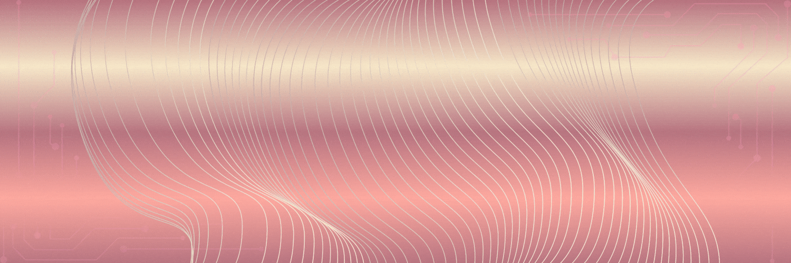

  

  
  

 

> "Life is the ultimate project; I'm just here to design the interface."

I am a **Class 12 Science student** navigating the intersection of logic and movement. I build with intent, design for clarity, and move with purpose.

- **💻 Logic:** Deep-diving into CS foundations and web architecture.
- **🎨 Vision:** Minimalist designer focused on flat-vector aesthetics.
- **🏃‍♀️ Motion:** Driven by the discipline of sports—applying field energy to the terminal.

 

  

 

  
  

---

  <code>optimizing_for_impact...</code>

